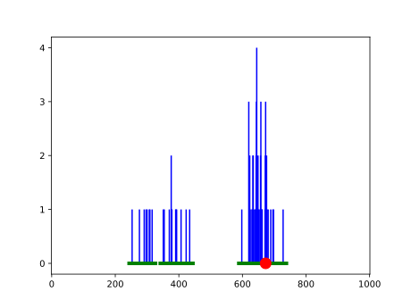

# Install

    $ (cd lib && make install)

# Examples

    $ python3 example/paper.py
    {10, 11, 12, 13, 14, 15, 16, 17, 18, 19, 20, 21, 22, 23}
    $ python3 example/gauss.py
    z G x correct?: [396, 405] [(387, 415)] 500 False
    z G x correct?: [396, 405, 500] [(301, 510)] 446 True
    z G x correct?: [396, 405, 500, 446] [(332, 505)] 562 False
    $ python3 example/plot.py

# Documentation

    $ python3 -m pydoc conformal.gamma
    Help on function gamma in conformal:

    conformal.gamma = gamma(name, z, eps)
	Return the conformal prediction set. z is a list-like container of
	examples, eps is a probability of error, name is a string
	indicating nonconformity measure, possible values are "nn"
	(nearest neighbor), "mean", "median".

	>> conformal.gamma("nn", [1, 1, 2, 2, 3, 1, 1], 0.05)
	{0, 1, 2, 3, 4}

# References

- Shafer, G., and Vovk, V. "A tutorial on conformal prediction."
  Journal of Machine Learning Research 9.Mar (2008): 371-421.
  [pdf](https://jmlr.csail.mit.edu/papers/volume9/shafer08a/shafer08a.pdf)

- Vovk, V., Gammerman, A., & Shafer, G. (2005). Algorithmic learning
  in a random world. Springer Science & Business Media.
  [alrw.net](http://alrw.net)
